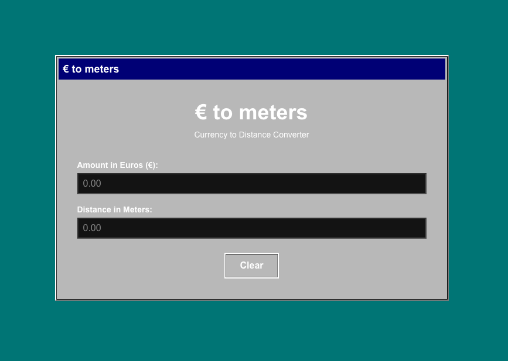

# € to meters

> In a talk I heard that, obviously, euros would not convert to meters. Well, actually! 🤓

A retro Windows 98 styled web application that converts euros to meters based on the physical dimensions of euro banknotes and coins.



## Features

- **Windows 98 UI**: Authentic retro styling with classic beveled borders, system colors, and MS Sans Serif font
- **Bidirectional Conversion**: Convert from euros to meters or meters to euros
- **Smart Denomination Breakdown**: Uses a greedy algorithm to intelligently break down amounts into optimal combinations of banknotes and coins
- **Real Physical Dimensions**: Calculations based on actual euro currency sizes:
  - Banknotes: €5 (120mm) to €500 (160mm)
  - Coins: €0.01 (16.25mm) to €2 (25.75mm)

## How It Works

### Euro to Meters

Enter an amount in euros and the app calculates the total distance if you lined up the physical currency side by side. For example:

- €106 = 1×€100 note (147mm) + 1×€5 note (120mm) + 1×€1 coin (23.25mm) = **0.29 meters**

### Meters to Euros

Enter a distance in meters and the app calculates how much money you'd need to cover that distance with physical currency.

### Installation

```bash
# Install dependencies
npm install

# Run development server
npm run dev

# Run tests
npm test
```

Open [http://localhost:3000](http://localhost:3000) to view the app.

## Project Structure

```
├── app/
│   ├── page.tsx          # Main page component
│   ├── layout.tsx        # Root layout with metadata
│   └── icon.svg          # Favicon
├── components/
│   ├── button.component.tsx
│   ├── input.component.tsx
│   └── win98-window.component.tsx
├── logic/
│   ├── euro-to-meters.function.ts
│   ├── euro-to-meters.test.ts
│   ├── meters-to-euro.function.ts
│   ├── meters-to-euro.test.ts
│   └── sizes.ts          # Euro denomination dimensions
└── jest.config.js
```

## License

MIT
